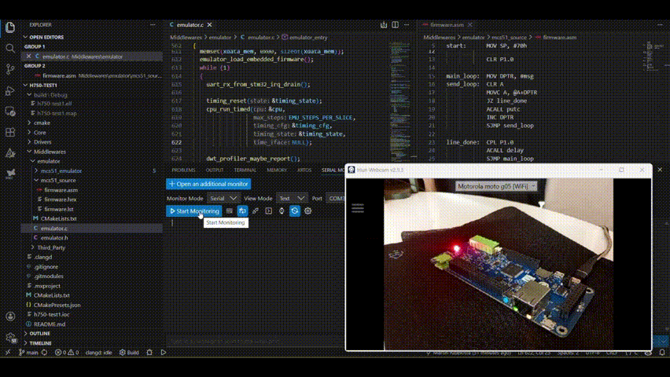

# Run legacy 8051 firmware on STM32 with no modification and accurate timing

This project demonstrates real 8051 firmware running unmodified on STM32H750 with working GPIO, UART and timers.

## What this demo shows

- Original 8051 firmware running unmodified
- GPIO mapped to STM32 pin (P1.0 → PA8)
- UART output mapped to USART1
- Real hardware execution with accurate timing

This is not a simulator. The firmware is executed on a real STM32 microcontroller.

## Overview

This project provides a runtime that executes MCS-51 (8051) firmware on STM32 microcontrollers with accurate timing and real hardware integration.

The original firmware runs unmodified, preserving behavior, timing, and peripheral interactions.

## Core Emulator

This project is built on top of the MCS51 Emulator Core:
https://github.com/martinribelotta/mcs51_emulator

## Key Features

- Binary compatibility with 8051 firmware
- No source code required
- Accurate timing model (cycle-based execution)
- Runs on real STM32 hardware (not a simulator)
- GPIO, UART, and timers supported
- Memory-mapped SFR and XRAM interception
- Firmware loading from Intel HEX or embedded binary
- Instruction trace and debugging support

## What Problem This Solves

Many industrial and embedded systems rely on legacy 8051 firmware running on obsolete or unavailable hardware.

Rewriting firmware is expensive, risky, and often not feasible.

This runtime allows existing firmware to run on modern hardware platforms without modification.

## How It Works

- The original firmware is loaded into the runtime
- The 8051 CPU is emulated with cycle-accurate timing
- SFR accesses are mapped to STM32 peripherals
- GPIO, UART, and timers are translated to HAL drivers
- The firmware executes as if it were running on original hardware

## Timing Model

The runtime uses cycle-based execution and reproduces original firmware timing.

Clock-dependent behavior is preserved, allowing firmware that relies on timing to run correctly.

## Migration Approach

- No firmware changes required
- Incremental peripheral mapping
- Behavior validated on real hardware

## Example

Original firmware:

- Toggles a GPIO pin
- Sends data over UART

Running on STM32H750:

- P1.0 mapped to PA8
- UART mapped to USART1

Result:

- LED toggles correctly
- Serial output matches original behavior
- No firmware changes required

## Quick Start

1. Build and flash to STM32H750
2. Connect UART (115200 baud)
3. Observe:
   - LED toggling on PA8
   - Serial output from original firmware

## Embedding firmware from HEX

The build can embed 8051 firmware directly from an Intel HEX file:

- Input: `Middlewares/emulator/mcs51_emulator/mc51code/*.hex`
- Build pipeline: `.hex -> .bin -> linked object`
- Runtime load: the embedded blob is copied to emulator CODE memory at startup

Requirements:

- ARM toolchain (`arm-none-eabi-objcopy`) already used by this project

Select a different HEX firmware with CMake cache variable:

- `MCS51_FW_HEX=<absolute-or-relative-path-to-hex>`

If the selected HEX file is not found, build still succeeds and the emulator falls back to the built-in demo program.

## Use Cases

- Industrial controller migration
- PLC hardware replacement
- Legacy system maintenance
- Firmware preservation
- Reverse engineering and analysis

## Demo

This repository includes a working example:

- 8051 firmware running on STM32H750
- GPIO mapped to physical pin
- UART output visible on host

## Project Structure

- mcs51_emulator: portable CPU core
- mcs51_emulator_h750: STM32 integration
- HAL bridge for peripherals

## Status

The runtime is functional and running real firmware with:

- Accurate timing
- Working GPIO, UART, and timers
- Execution on STM32 hardware

## Commercial Use

This project can be used to migrate legacy 8051 firmware to modern platforms.

If you are working with obsolete hardware or need to preserve existing firmware, this runtime can help reduce cost and risk.
